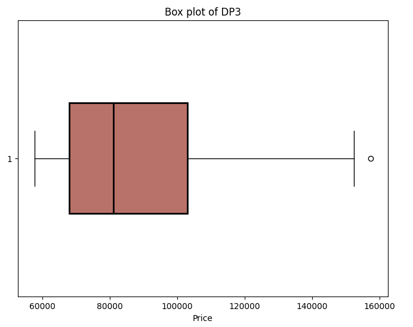
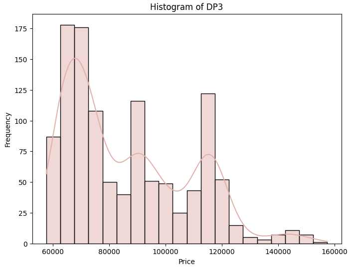
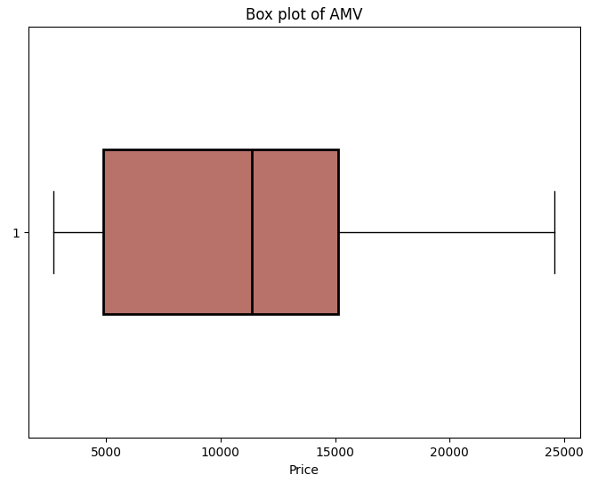
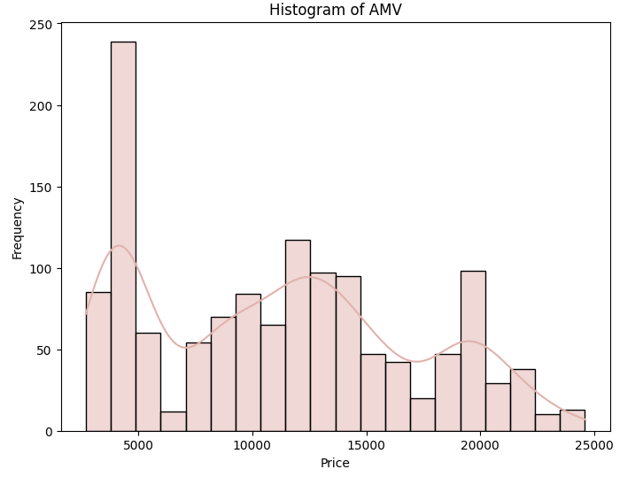

# 📂 Dataset Documentation

The **`Dataset/`** folder contains raw data and supporting descriptions used for analysis and modeling in the project *Data Analysis in Business*.  

---

## 📑 Files in Dataset/

### 1. `Description.txt`
- Provides an overview of the datasets used throughout labs and the final project.  
- Includes metadata such as **source (Investing.com)**, **companies under study (DHT, DP3, AMV)**, and a description of columns.

---

## 📊 Stock Price Data (2019–2024)

Historical daily stock prices were collected from [Investing.com](https://www.investing.com) for three Vietnamese pharmaceutical companies:

| Symbol | Company Name                         | Source Link |
|--------|--------------------------------------|-------------|
| **DHT** | Hataphar – Ha Tay Pharmaceutical JSC | [View](https://www.investing.com/equities/hataphar) |
| **DP3** | Central Pharmaceutical JSC No3       | [View](https://www.investing.com/equities/central-pharmaceutical-jsc-no3) |
| **AMV** | American Vietnamese Biotech Inc      | [View](https://www.investing.com/equities/amvibiotech) |

---

### 📌 Data Attributes

| Column       | Description |
|--------------|-------------|
| **Date**     | Trading date |
| **Price**    | Closing price |
| **Open**     | Opening price |
| **High**     | Highest price during the trading session |
| **Low**      | Lowest price during the trading session |
| **Vol.**     | Trading volume |
| **Change %** | Percentage change compared to the previous day’s closing price |

👉 In this project, **`Price (Close)`** is the main target variable used for forecasting.  

---

## 📊 Descriptive Statistics

Summary statistics of the collected stock price data:

| Company | Records | Mean Price | Std. Dev. | Min | Max |
|---------|---------|------------|-----------|-----|-----|
| **DHT** | 1320    | 16,583     | 4,149     | 9,384 | 29,400 |
| **DP3** | 1146    | 86,519     | 21,584    | 57,600 | 157,500 |
| **AMV** | 1322    | 11,167     | 5,811     | 2,700 | 24,589 |

---

## 📈 Data Visualization

Visual exploration of distributions and volatility was performed using **boxplots** and **histograms**.

### DHT
  

### DP3
  

### AMV
  

---

## 🧭 Usage in the Project

- **Exploratory Data Analysis (EDA):** Descriptive statistics, volatility, and distribution analysis.  
- **Feature Engineering:** Used to build inputs for statistical, ML, and DL forecasting models.  
- **Forecasting Target:** Closing price (`Price`) over short (30-day), medium (60-day), and long (90-day) horizons.  

---

## 🔗 Notes
- Data is limited to 2019–2024, covering both pre- and post-Covid market volatility.  
- The dataset provides insights into pharmaceutical stock performance in the Vietnamese market and serves as the foundation for comparative analysis between **statistical, machine learning, and deep learning models**.
