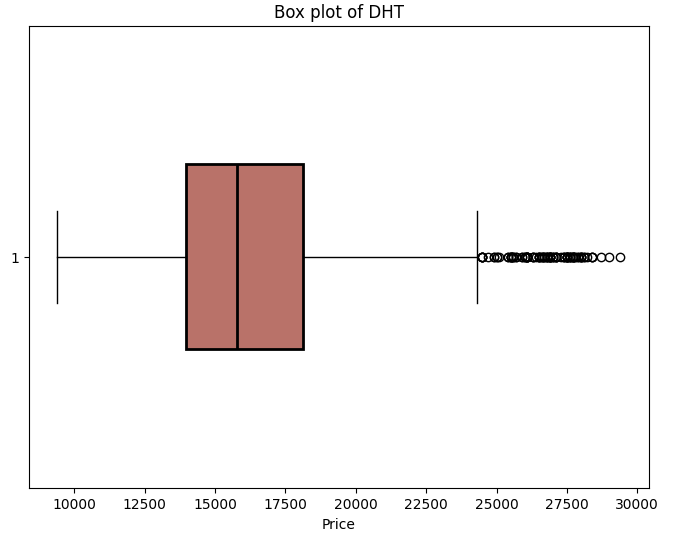
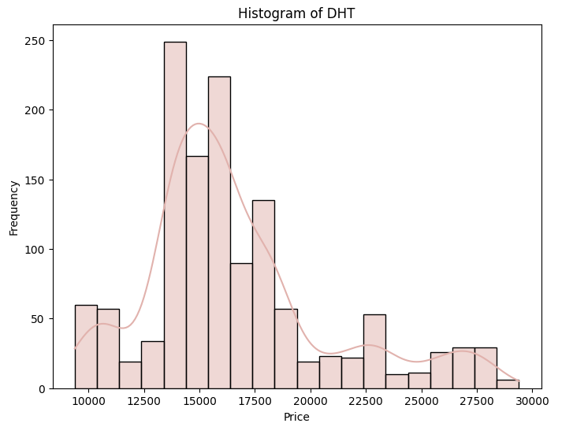
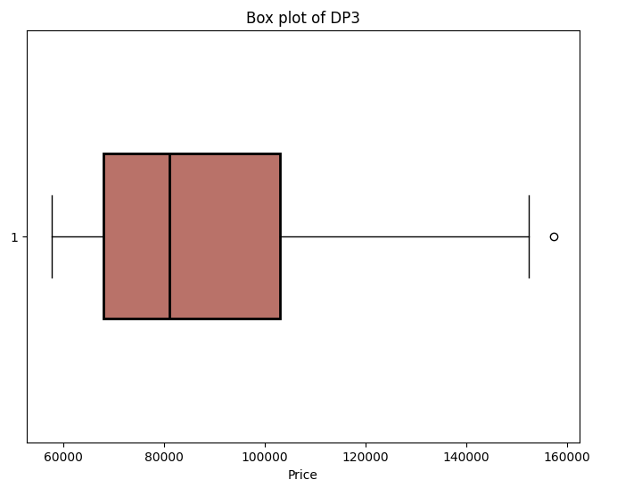
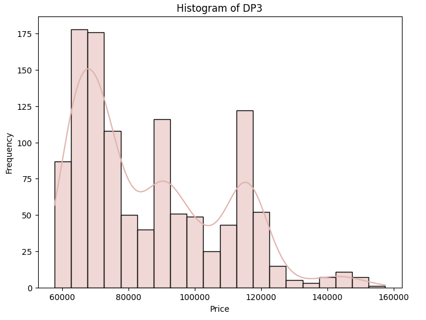
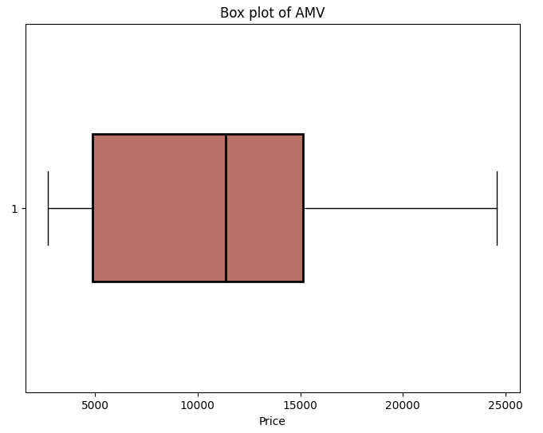
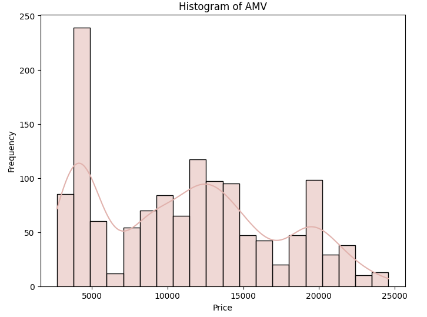
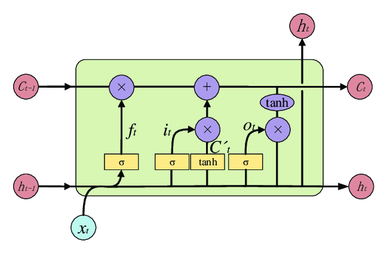

# 📊 IS403.O22.HTCL – Data Analysis in Business

* **Lecturer:** Assoc. Prof. Ph.D Nguyen Dinh Thuan  
* **Instructor:** Mr. Nguyen Minh Nhut  

---

## 👥 Team Information – Team 2

| No. | Student ID | Full Name               | Algorithms Responsible For | Distribution |
| --- | ---------- | ----------------------- | -------------------------- | ------------ |
| 1   | 21522179   | Nguyen Chi Kha (Leader) | LR-CF-DP, ARIMA, GRU       | 100%         |
| 2   | 21521576   | Bui Dinh Trieu          | FFT, RNN                   | 100%         |
| 3   | 21522005   | Nguyen Minh Duy         | LR, LSTM, LightGBMModel    | 100%         |

---

## 📌 Project Information

**Title:**  
*Forecasting Stock Price Accuracy for Vietnamese Pharmaceutical Firms through Ensemble Statistical, Machine Learning, and Deep Learning Models*  

**Datasets:**  
Historical stock performance (2019–2024) collected from [Investing.com](https://www.investing.com):  
- [DHT – Hataphar](https://www.investing.com/equities/hataphar)  
- [DP3 – Central Pharmaceutical JSC No3](https://www.investing.com/equities/central-pharmaceutical-jsc-no3)  
- [AMV – American Vietnamese Biotech Inc](https://www.investing.com/equities/amvibiotech)  

**Algorithms Implemented:**  
- **Statistical Models:** Linear Regression (LR), LR with Calendar Fourier & Deterministic Process (LR-CF-DP), ARIMA, Fast Fourier Transform (FFT)  
- **Machine Learning Models:** Light Gradient Boosting Machine (LightGBM)  
- **Deep Learning Models:** Recurrent Neural Network (RNN), Gated Recurrent Unit (GRU), Long Short-Term Memory (LSTM)  

---

## 🗂 Repository Structure
```

minzi03-data-analysis-in-business/
│── README.md                     # Project documentation
│
├── Dataset/                      # General dataset descriptions
│   └── Description.txt
│
├── documentation/                # Supporting documentation
│   ├── Regulation.docx
│   └── WRITING A SCIENTIFIC REPORT.docx
│
├── LAB/                          # Practical lab exercises
│   ├── Lab1/ (Descriptive Statistics)
│   ├── Lab2/ (Probability & Inference)
│   ├── Lab3/ (Regression Analysis)
│   └── Lab4/ (Time Series Analysis)
│
└── Latex\_Report/                 # Final report in LaTeX (IEEE format)
├── Report.tex
├── ieeeojies.cls
└── bibliography/Figure/      # Figures for EDA & results

```

---

## 📅 Work Distribution

1. **Week 1** – Data Collection (all members)  
2. **Week 2** – Abstract, Introduction, Related Work, Materials (all members)  
3. **Week 3** – Statistical Models: LR, ARIMA, FFT  
4. **Week 4** – ML Model: LR-CF-DP  
5. **Week 5** – DL Models: RNN, GRU, LSTM, LightGBM  
6. **Week 6** – Evaluation & 30-day Forecast  
7. **Week 7** – Evaluation & 60/90-day Forecast  
8. **Week 8** – Final Report (all members)  

---

## 📊 Dataset Overview

| Company | Records | Mean Price | Min | Max |
|---------|---------|------------|-----|-----|
| DHT     | 1320    | 16,583     | 9,384 | 29,400 |
| DP3     | 1146    | 86,519     | 57,600 | 157,500 |
| AMV     | 1322    | 11,167     | 2,700 | 24,589 |

**Exploratory Data Analysis (EDA):**  
### DHT  
   

### DP3  
   

### AMV  
   

---

## 🧠 Methodology

- **Linear Regression** (with Calendar Fourier & Deterministic Process for seasonality & trend)  
- **ARIMA** (classical time series)  
- **FFT** (frequency domain analysis)  
- **LightGBM** (boosted decision trees for regression)  
- **Deep Learning** (RNN, GRU, LSTM for sequential data learning)  

### Example: LSTM Architecture  
  

---

## ✅ Results

### AMV Dataset
| Model | RMSE | MAPE | MSLE |
|-------|------|------|------|
| Linear Regression | 5694 | 39.9% | 0.11 |
| FFT               | 9667 | 71.1% | 1.56 |
| ARIMA             | >9000 | >30% | – |
| **LSTM**          | **485** | **2.72%** | 0.0011 |
| LightGBM          | 0.006 | 20.7% | 4.16 |

**Visualization:**  
.png)  
.png)  

---

### DP3 Dataset  
.png)  
- **LSTM achieved MAPE 1.7–2.4%, lowest error across all models.**  

---

### DHT Dataset  
.png)  
- **LSTM achieved MAPE ~3%, outperforming ARIMA/FFT (30–70% errors).**  

---

## 🛠️ Tools & Technologies

- **Python:** NumPy, pandas, scikit-learn, statsmodels, TensorFlow/Keras, LightGBM  
- **Excel/CSV:** preliminary exploration  
- **Jupyter Notebook:** model prototyping & evaluation  
- **LaTeX (IEEE):** final scientific report  
- **MS Word:** lab documentation  

---

## 🚀 Learning Outcomes

- Applied **descriptive statistics, probability, and regression** in real business context  
- Implemented **time series forecasting** with classical and modern models  
- Compared **statistical vs. ML vs. DL performance**  
- Produced a **professional IEEE-style report**  
- Strengthened **teamwork & research skills** in a real data analysis project  

---

## 📑 Example Applications

- Short/long-term **forecasting of pharmaceutical stock trends**  
- **Ensemble model comparison** for financial prediction  
- Demonstration of **AI-driven decision support** in the Vietnamese stock market  

---

## 👥 Authors
- **Nguyen Chi Kha** – LR-CF-DP, ARIMA, GRU  
- **Bui Dinh Trieu** – FFT, RNN  
- **Nguyen Minh Duy** – LR, LSTM, LightGBM  

---

## 📚 References

- Xiao & Wang (2017). *A hybrid machine learning approach to stock price prediction.*  
- Nelson et al. (2017). *Stock market’s price movement prediction with LSTM neural networks.*  
- Mamon et al. (2021). *Forecasting Stock Index Returns During COVID-19.*  
- Ke et al. (2017). *LightGBM: Gradient Boosting Decision Tree.*  
